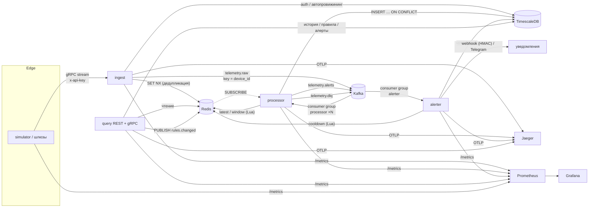

# Архитектура

## Путь одного батча

1. **Шлюз → ingest.** Двунаправленный gRPC-стрим несёт батчи до 1000
   измерений. API-ключ из метаданных резолвится в шлюз (кеш, схлопывание
   одинаковых запросов через singleflight). Неизвестные устройства
   автоматически регистрируются под этим шлюзом; чужой шлюз не может
   перехватить устройство.
2. **Валидация и дедупликация.** Расхождение часов, NaN/Inf и пустые поля
   отбрасываются по каждому измерению. Ключ `device_id:seq` пишется в Redis
   через `SET NX EX` одним пайплайном; уже виденные ключи получают ack
   `DUPLICATE`.
3. **Продюсер.** Новые измерения заворачиваются в `TelemetryEvent` и
   отправляются с `acks=all`, идемпотентным продюсером и zstd. Контекст
   трейса едет в заголовках записи. Только после этого клиенту уходит `OK`.
4. **Processor.** Забирает до `BATCH_SIZE` записей, продолжает трейс каждой,
   затем: одна вставка через `unnest` в TimescaleDB, один пайплайн в Redis
   для последних значений и закрытых минутных окон, проверка правил,
   отправка алертов. Оффсеты коммитятся после успеха всего перечисленного.
5. **Alerter.** Сохраняет переходы состояний через `pgx.Batch`, применяет
   cooldown на пару (правило, устройство) в Redis и рассылает уведомления с
   повторами.
6. **Query.** REST (`chi`) и gRPC читают один репозиторий; изменения правил
   рассылаются процессорам через Redis pub/sub.

## Отказы и поведение

| Отказ | Поведение |
| --- | --- |
| Kafka недоступна | Ingest отвечает `REJECTED` с «retry» и снимает метку дедупликации; шлюз повторяет с тем же seq |
| TimescaleDB недоступна | Processor повторяет батч с backoff, оффсеты не коммитятся, Kafka буферизует; ingest продолжает принимать |
| Redis недоступен | Ingest отвечает `Unavailable`; processor повторяет батч; alerter уведомляет без cooldown (fail-open, с записью в лог) |
| Processor упал посреди батча | Батч доставляется повторно; все приёмники идемпотентны (ADR-0002) |
| Битая запись | Уходит в `telemetry.dlq` с заголовками причины и оффсета; батч продолжается |
| Webhook лежит | 3 повтора с backoff, затем запись в лог; алерт уже сохранён |
| Сеть у шлюза моргнула | Стрим переоткрывается с backoff, неподтверждённый батч уходит повторно с теми же seq → ack `DUPLICATE`, данных дважды нет |

## Масштабирование

* **ingest** без состояния; масштабируется за gRPC-aware балансировщиком.
* **processor** масштабируется до числа партиций `telemetry.raw` (в Compose
  6, по умолчанию 2 реплики). Состояние по устройствам переезжает вместе с
  партициями.
* **alerter** аналогично, до 3 партиций.
* **query** без состояния.
* Хранилища: чанки и retention в TimescaleDB; Redis ограничен TTL и LRU.

## Наблюдаемость

* Метрики Prometheus у каждого сервиса на `:9090/metrics`, дашборд
  автоматически подключается в Grafana (`Telemetry Platform`).
* Трейсы OpenTelemetry: gRPC → заголовки Kafka → processor → спаны
  Postgres/Redis, в Jaeger виден один трейс на батч измерений.
  Два намеренных решения: стрим шлюза живёт часами, поэтому каждый батч
  внутри него начинает **новый корневой трейс**, который только ссылается
  (link) на спан стрима, иначе стрим превращается в один бесконечный трейс,
  который не примет ни один бэкенд; и батч консьюмера смешивает записи из
  многих трейсов продюсера, поэтому processor открывает собственный спан
  батча для работы с базой и Redis и ссылается на записи, а короткие спаны
  «process» на каждую запись продолжают трейс продюсера.
* Структурированные JSON-логи (`slog`) с `trace_id` для корреляции.
* `/healthz` (liveness) и `/readyz` (зависимости) у каждого сервиса.
